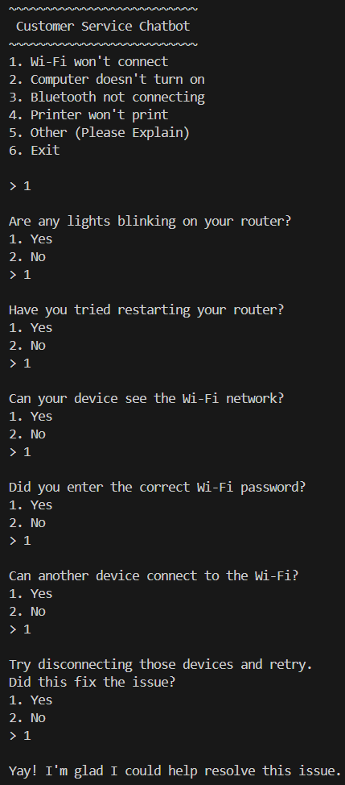
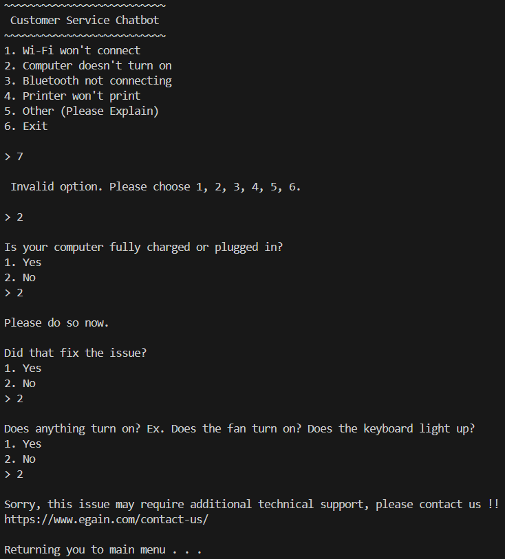
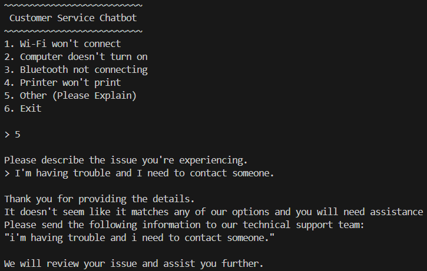

# egain_chatbot

## Overview
This project is a Python-based command-line chatbot that helps users troubleshoot common issues through an interactive conversation. 
The chatbot guides users through different categories, asks follow-up questions, validates input, and provides possible solutions based on user responses.

## Setup / Installation

### Requirements
- Python 3.x installed
- Command-line Terminal (Terminal, Command Prompt, PowerShell, etc.)

### Installation Steps
1. Clone the repository:

```bash
git clone <(https://github.com/kmchen3/egain_chatbot/)>
cd <project-folder>
python main.py
```

## Approach
Each flow handles a specific problem category and guides the user through a series of questions to identify possible solutions.
- Input validation: Ensures users enter valid choices and prompts them to retry when invalid input is provided.
- Modular functions: Separates different chatbot flows to improve readability and maintainability.
- Decision-based logic: Uses conditional statements to determine responses based on user selections.

## Chatbot Example



## Chatbot Input Validation



## Chatbot Other

